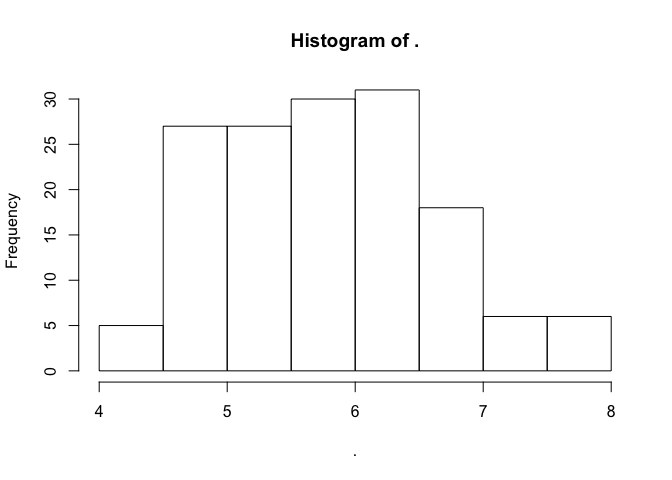
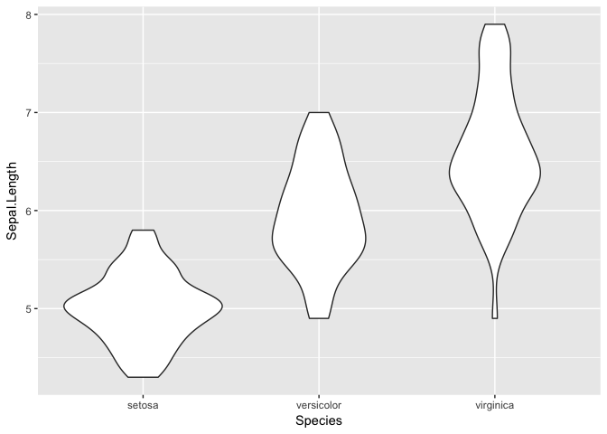

This is a Test Post
===================

**Let's include bold text** and *italics*

> maybe a block quote

Just to see how things work and if .Rmd works

what about some code?

    library(ggplot2)
    library(dplyr)

    ## Warning: package 'dplyr' was built under R version 3.4.1

    ## 
    ## Attaching package: 'dplyr'

    ## The following objects are masked from 'package:stats':
    ## 
    ##     filter, lag

    ## The following objects are masked from 'package:base':
    ## 
    ##     intersect, setdiff, setequal, union

    iris$Sepal.Length %>% hist()

    iris %>% distinct(Sepal.Length) %>% 
      merge(iris, by = "Sepal.Length") %>% 
      ggplot() +
      geom_violin(mapping = aes(x = Species, y = Sepal.Length))

