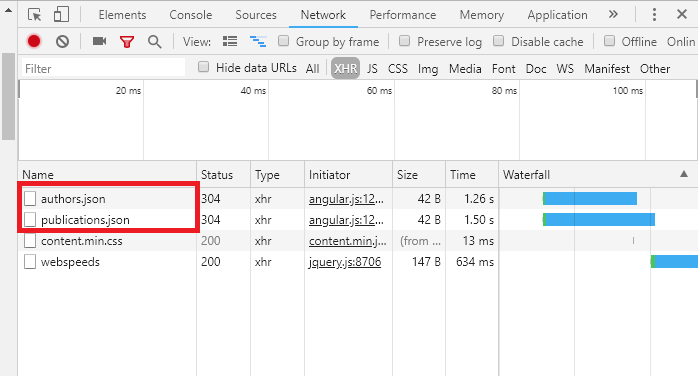

#### 5 minute read

My research sometimes involves concentraed bursts of highly productive
procrastination. Recently, while reading a paper on [High Performance
computing in R](https://ai.google/research/pubs/pub37483) (because
science
),
I wandered onto [Google's publications
database](https://ai.google/research/pubs). Google has a publications
API?? I was overcome by a strong yet familiar curioisty. I had to know a
few things then and there:

1.  **What are the trends in publications at Google over time? Have they
    increased?
    
    Decreased?
    
    **
2.  **What are the most popular
    
    topics? **
3.  **Who is doing all of this writing anyway? Who are the "professors"
    of Google
    (
    POG)?**

The site was relatively simple to scrape. By examining the XHR details
within Chrome developer tools (*XHR is short for XMLHttpRequest - this
is the type of request used to fetch XML or JSON data*), I saw that data
for authors and publications came from two JSON databases:
`authors.json`, and `publications.json`

------------------------------------------------------------------------

------------------------------------------------------------------------

Can has data please?
--------------------

A JSON API is a delight to scrape. I used the `jsonlite` R package and
was off and away. It turns out the API has more publications in it than
what it displays online! At the time of writing, there are 4,457
Google-authored papers, and 7,456 non-Google papers.

    library(jsonlite)  # for json data
    library(tidyverse) # data wrangling and visualization
    library(forcats)   # for reordering factors
    library(colormap)  # color scales
    library(knitr)     # for tables

    # google apis for authors and publications
    auth <- "https://ai.google/static/data/authors.json"
    pubs <- "https://ai.google/static/data/publications.json"

    # get authors JSON list and extract the dataframe
    a <- fromJSON(auth)
    a <- a$authors

    # same for publications
    p <- fromJSON(pubs)
    p <- p$publications

<table>
<thead>
<tr class="header">
<th align="center">is_google</th>
<th align="center">n</th>
</tr>
</thead>
<tbody>
<tr class="odd">
<td align="center">FALSE</td>
<td align="center">7456</td>
</tr>
<tr class="even">
<td align="center">TRUE</td>
<td align="center">4457</td>
</tr>
</tbody>
</table>

------------------------------------------------------------------------

What are the trends  in publications over time?
---------------------------------------------------------------------------------------------------------------------------------------------------------------------

Over time, the number of papers Google stores in this API shift from
research conducted by non-Google authors to Google authors. As we see
later in this post, this appears to be because **Google successfully
hires academics and researchers involved in the research critical to
their business. As Google ingests outside researchers, Google's own
research protfolio grows.**

    trends <- p %>% 
      group_by(year, is_google) %>% 
      summarise(n = n()) %>% 
      ggplot() +
      geom_line(aes(year, n, 
                    color = factor(is_google, 
                labels = c("Non-Google","Google"))),
                lwd = 1.5, alpha = .7) +
      scale_color_viridis_d() + 
      labs(color = "Source", 
           title = "Google's Publications API",
           subtitle = "Annual Publication Count",
           x = "Year", y = "Count") +
      theme_minimal()

    trends

------------------------------------------------------------------------

What are the most  topics researched at Google?
-------------------------------------------------------------------------------------------------------------------------------------------------

Most of the papers are classified as "unknown", so we remove these to
see what **labeled topics** are written about the most. The top 15
fields show that Google prioritizes machine intellegence, machine
perception, algorithms, and natural language processing among others. A
few core teams like [Brain/AI](https://ai.google/research/teams/brain)
are responsible for a lot of published research.

    # conveniently only papers authored by Googlers have a topic!
    i    <- sapply(p$tag_pks, function(x){ifelse(length(x) == 0, FALSE, TRUE)})
    topics <- p$tag_pks[i] %>% do.call(c, .) %>% str_replace_all("research-area-", "")

    data.frame(topics = topics) %>% 
      count(topics) %>% 
      top_n(16) %>% 
      filter(topics != "unknown") %>% 
      ggplot(aes(fct_reorder(topics, n), n)) +
      geom_col(fill = colormap(colormaps$viridis, nshades = 15)) +
      coord_flip() +
      theme_minimal() +
      labs(title = "Googlers Like to Write About...",
           subtitle = "Count of Papers Published from 1998-2018", y = "Count", x = "")

------------------------------------------------------------------------

Who are the POG? The Professors of Google  ?
--------------------------------------------------------------------------------------------------------------------------------------------------------------------------------------------------------------------------------------------------------------------------------------------------------------------

Not surprisingly, the top 3 authors in terms of raw publication counts
are key members of the Google Brain and Google Research teams. I present
to you... the POG:

1.  [Mehryar
    Mohri](https://ai.google/research/people/author122)  
2.  [Samy
    Bengio](http://bengio.abracadoudou.com/)  
3.  [Corinna
    Cortes](0https://ai.google/research/people/author121)

These people are serious nerds capable of moving nerd mountains. Much
respect.

    # function to get google and non-google authors as a vector
    get_google_auths <- function(x, googler){
      v <- x %>% 
        filter(at_google == googler) %>% # filter for googlers
        .[, "name"]                   # get author names
      return(v)
    }

    # google atuhors
    ga <- lapply(p$authors, get_google_auths, TRUE)

    # remove empty elements
    i <- sapply(ga, function(x){ifelse(length(x) == 0, FALSE, TRUE)})
    gav <- ga[i] %>% do.call(c, .)

    # view top 15 google authors
    data.frame(author = gav) %>% 
      count(author) %>% 
      top_n(10, wt = n) %>% 
      ggplot(aes(fct_reorder(author, n), n)) +
      geom_col(fill = colormap(colormaps$viridis, nshades = 11)) +
      coord_flip() +
      theme_minimal() +
      labs(title = "The Professors of Google",
           subtitle = "Count of Papers Published from 1998-2018",
           y = "Count", x = "")

------------------------------------------------------------------------

Google's Amazing Ability to Attract Research Talent
---------------------------------------------------

The most popular non-Google authors include some google authors, likely
because they worked in other research-based industries (notably
academia) before joining the Big G.

Interestingly, [Martin Abadi](https://ai.google/research/people/abadi),
the top non-Google author in this database, started working for Google
in 2014. [Craig
Boutilier](https://ai.google/research/people/CraigBoutilier), the number
2 author on the non-Google list served a long career in academia before
coming to Google in 2015. Professor [Geoffrey
Hinton](https://ai.google/research/people/GeoffreyHinton) joined Google
in 2013. I see a pattern here...

    nga  <- lapply(p$authors, get_google_auths, FALSE)
    i    <- sapply(nga, function(x){ifelse(length(x) == 0, FALSE, TRUE)})
    ngav <- nga[i] %>% do.call(c, .)

    # view top 15 non-google authors
    data.frame(author = ngav) %>% 
      count(author) %>% 
      top_n(10, wt = n) %>% 
      ggplot(aes(fct_reorder(author, n), n)) +
      geom_col(fill = colormap(colormaps$viridis, nshades = 10)) +
      coord_flip() +
      theme_minimal() +
      labs(title = "Top Non-Google Authors",
           subtitle = "1970-2018",
           y = "Count", x = "")

Returning to the original publication count over time, the decrease in
non-Google activity is probably not because non-Googlers have stopped
researching, or that non-Googlers are no longer producing useful
research, but rather, **they've become part of the POG**: now they're
researching for Google.

    trends

This is probably common knowledge, but it felt like an AH HA moment

to me.

------------------------------------------------------------------------

Afterthought
------------

I wrote these sweet functions that extract the abstract and citation
count from each of the papers by navigating to their web links, only to
learn that Google throws an Error 503 that can only be resolved by
passing a CAPTCHA test...

which I delighted in because (1) Google stoped from doing a thing
,
and (2) it's midly ironic because Google's mission statement is:

> "Organize the world's information and make it universally accessible
> and useful."

Tis' a shame though, for it would be quite interesting to do some topic
modeling on the research going on at Google. There are ways to get
around this silly 503 of course, using Scopus, Web of Science, or other
bibliometric APIs. But procrastination is just that: a brief but
spectacular foray that must inevitably end. Until next time, it's been
real.

    # CAN HAS DATA FOR FUNTIMES PLZ? 

    # ERROR 503? WHY MAKE SAD?  =(

    library(rvest)
    # CSS selectors for google scholar abstract and citation count
    abstract <- ".gs_rs"      
    citation <- ".gs_or_cit+ a" 

    # get abstracts and citation count for all papers
    get_ab_cit <- function(url){
      site <- read_html(url)
      
      abstract  <- site %>% 
        html_nodes(".gs_rs") %>% 
        html_text()
      
      citations <- site %>% 
        html_nodes(".gs_or_cit+ a") %>% 
        html_text() %>% 
        str_extract_all("[0-9]", simplify = TRUE) %>% 
        paste(collapse="")
      
      return(list(abstract = abstract, citations = citations))
    }

    # get abstracts and citations for all ~12,000 papers
    ab_cit <- lapply(as.list(p$search_url), get_ab_cit)
