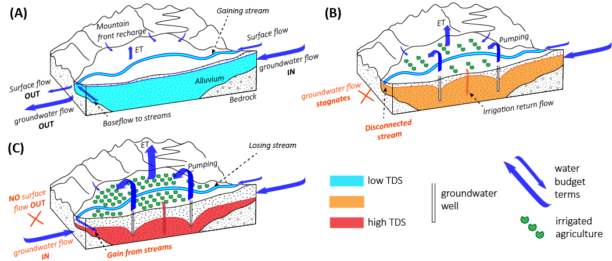
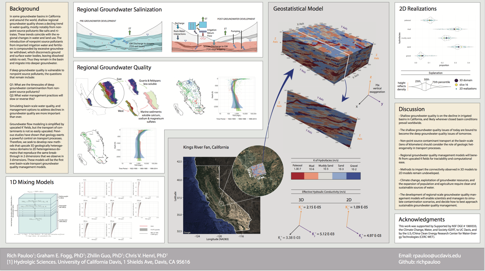
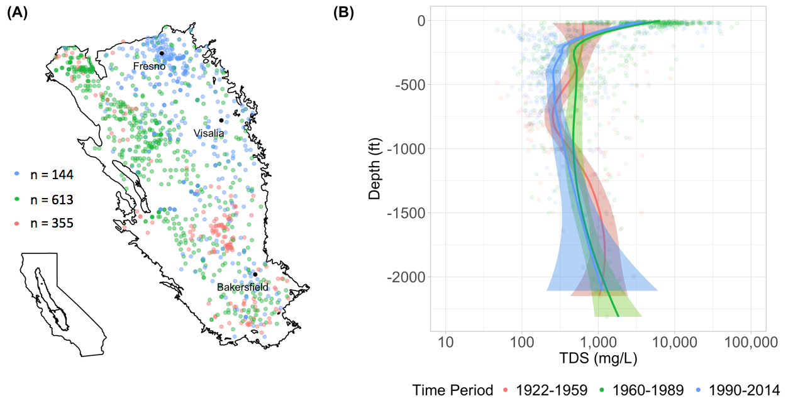
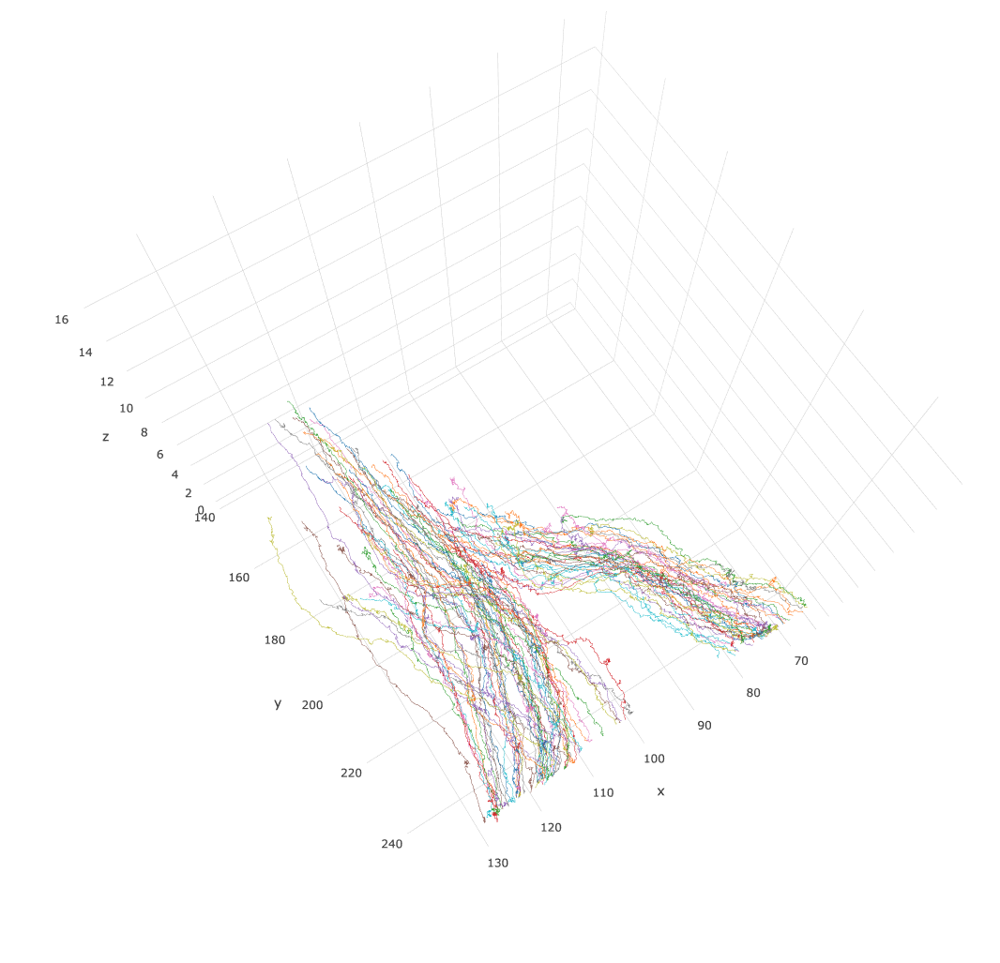
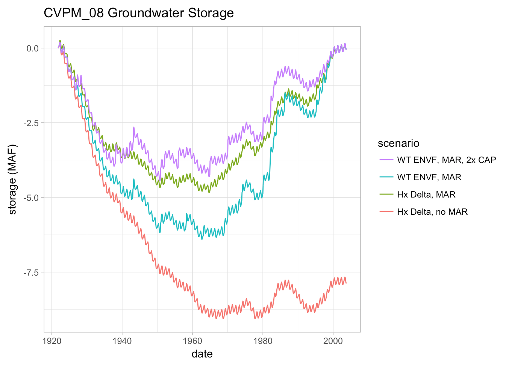
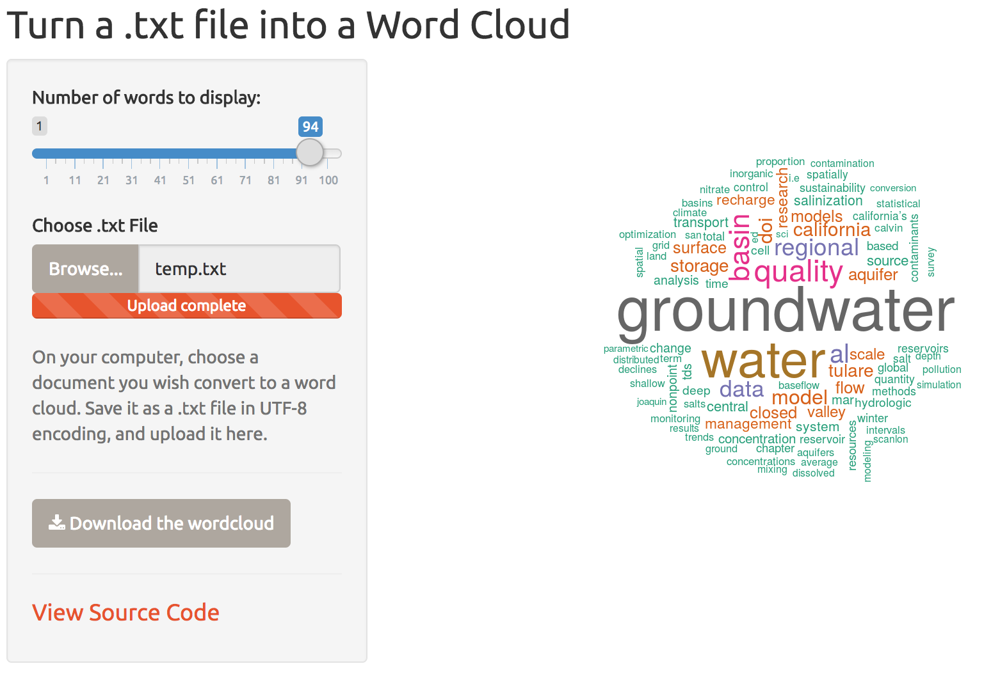

# ACADEMIC PROJECTS:

Global groundwater reserves are the largest store of freshwater resources not locked in frozen ice caps, glaciers, and continental ice sheets.[^fn1] Around the world, groundwater storage is in critial decline [^fn2] [^fn3], and groundwater quality faces equal if not more severe threats [^fn4] [^fn5] [^fn6]. 

The motivation of my research is to ensure that future generations have access to clean and abundant groundwater resources. 

My methods involve the mathematical modeling of hydrologic systems, primarly groundwater aquifers. I employ data science, programming, mapping, geostatistics, numerical flow and contaminant transport modeling, and machine learning to explore how to model groundwater systems, make predictions, and manage for best outcomes. Where conventional methods fail to address emergent problems, I develop new ones.

I am grateful to my funding sources, without which the following projects would not be possible:
* [National Science Foundation DGE #1069333, the Climate Change, Water, and Society IGERT, to UC Davis.](http://ccwas.ucdavis.edu/)
* [Department of Energy - U.S./China Clean Energy Research Center for Water Energy Technologies (CERC-WET)](https://cerc-wet.berkeley.edu/)

***

### Groundwater Quality Mapping in California
Total Dissolved Solids (TDS) are a measure of groundwater quality. However, these data are collected by various federal, state, local, nongovernmental, and private entities, often with different sampling protocol. This interactive map represents all publically available TDS data for the Tulare Basin in California's southern Central Valley.
 
  
*click on the picture to open the app*  

***
### Closed Basin Hydrogeology: a 1D Monte Carlo Mixing Model
In many parts of the world including the Southern Central Valley of California, groundwater quality is declining. TDS and other contaminants accumulate, but why? Groundwater pumping can disconnect ground and surface water, leading to the formation of closed hydrologic basins that accumualte contaminants. This hypothesis is supported by a 1D Monte Carlo mixing model of California's Tulare Basin.

***
### Upscaling the Advection Dispersion Equation
Efficiently modeling regional groundwater quality would be much aided by the development of simplified upscaled models that preserve the main contaminant transport physics.  

<iframe allowFullScreen frameborder="0" height="564" mozallowfullscreen src="https://player.vimeo.com/video/252802213" webkitAllowFullScreen width="640"></iframe>

***
### Machine Learning & Groundwater Quality
Can we predict groundwater quality (i.e. - TDS) from feature datasets (e.g. - land cover, land use, local geology, etc.)? What can machine learning approaches to groundwater quality reveal to us about the controls on groundwater quality? Ongoing work.

***
### Random Walk Particle Transport in Heterogeneous Media

Effectively modeling groundwater quality requires an understanding of contaminant transport in heterogeneous proous media. I am especially drawn to visualizing particle paths as a way to understand transport behavior.

  
*click on the picture to explore some results*  

***
### Groundwater Recharge Operating Rules

One way to improve groundwater quality is to recharge contaminated aquifers with relatively clean water. Actually getting that water into the ground is both a hydrogeologic and hydroeconomic process. It has to pay off. I explore groundwater recharge rules and scenarios with the [CALifornia VALue Integrated Network Model (CALVIN)](https://calvin.ucdavis.edu/node).

***
# PERSONAL PROJECTS:

### Word Cloud App
Upload a .txt file and turn it into a wordcloud. This app uses natural language processing libraries in R to clean, tokenize, and render a word cloud.

  
*click on the picture to open the app*  

***
### Interactive Conference Application 
Swipe through 2017 American Geophysical Union Conference Data in this interactive application.

  
*click on the picture to open the app*  

***
#### References

[^fn1]: Gleick, P. H., 1996: Water resources. In Encyclopedia of Climate and Weather, ed. by S. H. Schneider, Oxford University Press, New York, vol. 2, pp.817-823.

[^fn2]: Döll, P., Hoffmann-Dobrev, H., Portmann, F.T., Siebert, S., Eicker, A., Rodell, M., Strassberg, G., Scanlon, B.R., 2012. Impact of water withdrawals from groundwater and surface water on continental water storage variations. J. Geodyn. 59–60, 143–156. doi:10.1016/j.jog.2011.05.001

[^fn3]: Famiglietti, J.S., 2014. The global groundwater crisis. Nat. Clim. Chang. 4, 945–948. doi:10.1038/nclimate2425

[^fn4]: Kang, M., Jackson, R.B., 2016. Salinity of deep groundwater in California: Water quantity, quality, and protection. doi:10.1073/pnas.1600400113

[^fn5]: MacDonald, A.M., Bonsor, H.C., Ahmed, K.M., Burgess, W.G., Basharat, M., Calow, R.C., Dixit, A., Foster, S.S.D., Gopal, K., Lapworth, D.J., Lark, R.M., Moench, M., Mukherjee, A., Rao, M.S., Shamsudduha, M., Smith, L., Taylor, R.G., Tucker, J., van Steenbergen, F., Yadav, S.K., 2016. Groundwater quality and depletion in the Indo-Gangetic Basin mapped from in situ observations. Nat. Geosci. 1. doi:10.1038/ngeo2791

[^fn6]: United States Geologic Survey, N.A.W.Q.A., 2010. Water Quality in Principal Aquifers of the United States, 1991 – 2010 Circular 1360.