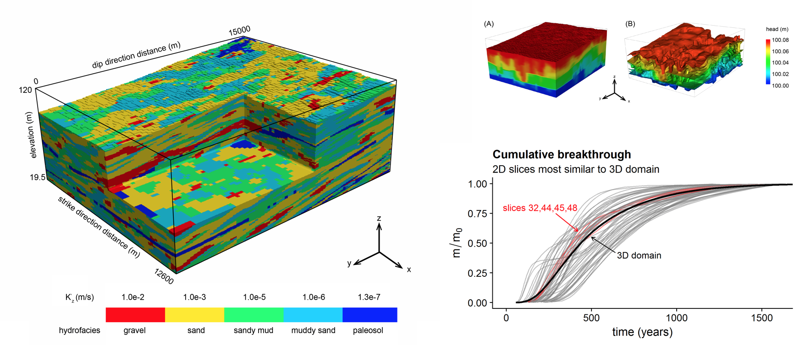

## Domestic Well Vulnerability to Drought and Unsustainable Groundwater Management

   

During the severe 2012-2016 drought, more than 2,500 domestic wells ran dry in California, the majority of which (n = 2,027) were in California's Central Valley [^fn1]. This left thousands of people without a reliable source of drinking water for months and, in some cases, years. Recent developments in California's Open and Transparent Water Data Platform (AB-1755) have made water data in California more available than ever before, enabling the first ever regional aquifer scale models of domestic well failure.  

Questions:  

* How do longer drought durations (i.e. - 4-8 years in length) impact well failure?  
* How do different groundwater management regimes (i.e. - business as usual, glide path, sustainable management) impact well failure?  

Paper: *submitted*  

**Pauloo, R.** & Escriva-Bou, A. & Dahlke, H. & Fencl, A. & Guillon H. & Fogg, G.E. (2019). “Domestic Well Vulnerability to Drought Duration and Unsustainable Groundwater Management in California’s Central Valley.”  

***
## Anthropogenic Basin Closure and Groundwater Salinization: An Unrecognized Threat to Water Quality Sustainability

Across the word, closed hydrologic basins form when basin outflow exceeds inflow and predominantly exits via evapotranspiration, leading to a subsequent accumulation of dissolved solids, and a decline in groundwater quality. We demonstrate that groundwater pumping and irrigation (particularly in an agriculturally intensive region) may close a basin, and explore the long-term (decades to centuries) groundwater quality consequences of this process, focusing on the Tulare Basin in California.  

Question:  

* What are the depths, timescales, and contaminant budgets of closed basin groundwater salinization?  

Paper: *in preparation*  

**Pauloo, R.** & Fogg, G.E. & Harter, T. & Guo, Z. (2019). “Anthropogenic Basin Closure and Groundwater Salinization: An Unrecognized Threat to Water Quality Sustainability.”  

***

## Towards Regional Groundwater Quality Management Models

  

Nonpoint-source groundwater contamination threatens to gradually degrade the quality of vast quantities of groundwater in many parts of the world. Hydrogeophysical models of fluid flow in porous media, and the equations to solve contaminant transport problems, were initially developed for field-scale point-source pollutants, and do not easily scale to nonpoint source loading regional scales. Here we develop regional-scale groundwater quality management models to address these challenges. In particular, these models strive to preserve 3D non-Fickian transport behavior.  

Question:

* Can non-Fickian contaminant transport effects produced by 3D heterogeneity be represented in 2D, and if so, what information is lost?  

The developed methods will allow hypothesis testing into currently unresearched phenomena in nonpoint source contaminant transport such as:  

* How will Managed Aquifer Recharge impact regional groundwater quality?  

Paper: *in preparation*  

**Pauloo, R.** & Fogg, G.E. & Guo, Z. & Henri, C.V. (2019). “Gradient-based Travel Path Dependency of Non-Point Source Contaminant Transport .”  

***
#### References

[^fn1]: Department of Water Resources, 2018. Locally Reported Household Water Shortages for Drought Assistance. Accessed November 11, 2018. [Website](https://mydrywatersupply.water.ca.gov/report/publicpage)